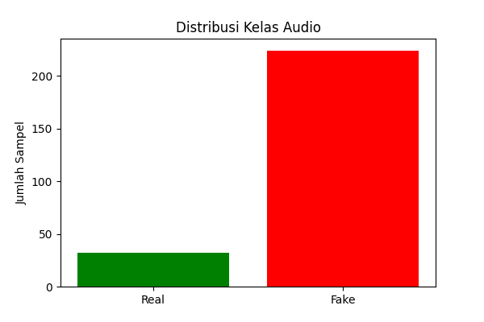
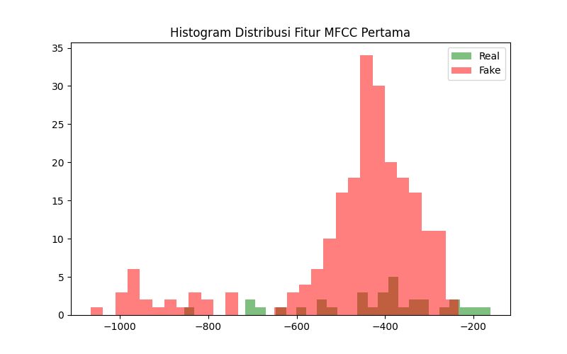
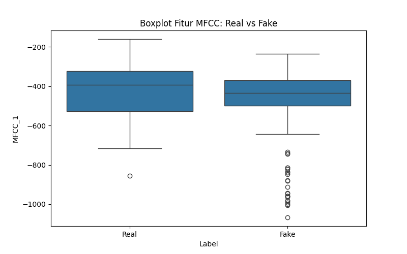
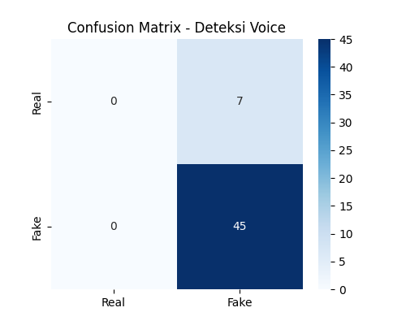

# Voice Cloning Detection AI

Proyek ini bertujuan untuk mendeteksi apakah sebuah sampel audio merupakan suara asli manusia (**Real**) atau hasil kloning/generatif AI (**Fake/Deepfake**). Proyek ini mengikuti alur kerja **CRISP-DM** (Cross-Industry Standard Process for Data Mining).
dataset : https://www.kaggle.com/datasets/syedowaisnawaz/merged-voice-detection

## 📊 Alur Kerja Proyek

### 1. Business Understanding
Meningkatnya teknologi AI memungkinkan pembuatan suara tiruan yang sangat mirip dengan aslinya. Hal ini menimbulkan risiko penipuan dan penyebaran misinformasi. Proyek ini hadir untuk memberikan solusi otomatis dalam memvalidasi keaslian identitas suara.

### 2. Data Understanding
Dataset terdiri dari audio berformat `.wav` yang dibagi menjadi dua kategori:
- **Real:** Suara asli manusia.
- **Fake:** Suara hasil kloning AI.

Fitur diekstrak menggunakan **MFCC (Mel-frequency cepstral coefficients)**, yang merupakan representasi spektrum jangka pendek dari suara manusia.

#### Visualisasi Distribusi Data
Berikut adalah distribusi jumlah sampel dalam dataset:


### 3. Data Preparation & Visualization
Sebelum masuk ke tahap modeling, dilakukan analisis fitur untuk melihat perbedaan karakteristik antara suara Real dan Fake.

#### Distribusi Fitur (Histogram)
Histogram ini menunjukkan bagaimana fitur suara Real cenderung berbeda sebarannya dibandingkan suara Fake:


#### Perbandingan Statistik (Boxplot)
Boxplot digunakan untuk membandingkan statistik (median dan varians) antar grup, memberikan gambaran visual yang mirip dengan analisis ANOVA:


### 4. Modeling
Model menggunakan algoritma **Random Forest Classifier** dengan parameter `class_weight='balanced'` untuk menangani ketidakseimbangan jumlah data antara kelas Real dan Fake.

### 5. Evaluation
Model dievaluasi menggunakan data uji (test set) untuk melihat akurasi dan kemampuan deteksi.

#### Confusion Matrix (Heatmap)
Heatmap ini menunjukkan performa model dalam menebak kelas yang benar:


---

## 🚀 Cara Menjalankan

1. **Install Dependensi:**
   Pastikan Anda sudah menginstal semua library yang dibutuhkan:
   ```bash
   pip install -r requirements.txt
   ```

2. **Jalankan Script:**
   Eksekusi script utama untuk memulai ekstraksi fitur, pelatihan model, dan pembuatan visualisasi:
   ```bash
   python voice_ai.py
   ```

3. **Lihat Hasil:**
   Setelah selesai, hasil evaluasi akan muncul di terminal dan grafik akan tersimpan dalam format `.png` di direktori proyek.

## 🛠️ Teknologi yang Digunakan
- **Python**
- **Librosa** (Ekstraksi fitur audio)
- **Scikit-Learn** (Machine Learning & Evaluasi)
- **Matplotlib & Seaborn** (Visualisasi Data)
- **Pandas & Numpy** (Pengolahan Data)
